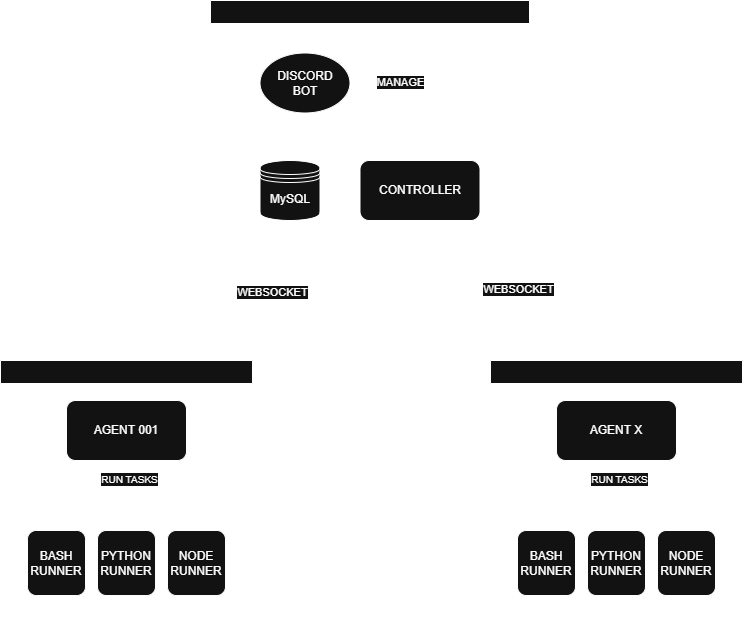

# 🤖 Automi

  

## 📋 Overview

Automi is a modular automation system designed to execute scripts (Bash, Python, Node.js) via distributed agents and control them through a WebSocket-based controller with Discord bot integration. It allows scheduling, managing and monitoring tasks across distributed agents with live status updates and logs.

## ✨ Features

- **🎛️ Centralized Controller**: Manages all agents and tasks from a single interface
- **🖥️ Agent System**: Distributed task execution across multiple machines
- **🤖 Discord Bot Integration**: Control your automation tasks through Discord commands
- **📜 Multi-language Task Execution**: Run tasks in Bash, Python, or Node.js
- **⏰ Task Scheduling**: Automate recurring tasks with flexible scheduling
- **🔄 Task Dependencies**: Create complex workflows with dependent tasks
- **🔑 Global Assets**: Store and use key-value pairs across all tasks and agents
- **📊 Logging System**: Comprehensive logging for monitoring and troubleshooting

## 🏗️ System Architecture

Automi consists of two main components:

- **🧠 Controller**: The central management server that coordinates all activities
- **🛠️ Agents**: Distributed workers that execute tasks on their host machines

  

## 🎬 Demo

You can view and explore the code directly in your browser using VS Code online:
[Open in VS Code](https://vscode.dev/github/sergiusz-x/automi)

  
   
  
   
  

## 📝 System Requirements

- Node.js (for running both Controller and Agents)
- Python (for executing Python scripts)
- MySQL database (for the Controller)
- Discord Bot (for the command interface)

## 📚 Documentation

For detailed information, please refer to the following documentation:

- [📥 Installation Guide](./docs/INSTALLATION.md)
- [🧠 Controller Documentation](./docs/CONTROLLER.md)
- [🛠️ Agents Documentation](./docs/AGENTS.md)
- [🤖 Discord Bot Documentation](./docs/BOT.md)

## 📜 License

This project is licensed under the MIT License - see the [LICENSE](./LICENSE) file for details.

## 🙏 Acknowledgments

This project was created with assistance from GitHub Copilot Agent. 🚀👨‍💻

The Automi logo was generated using ChatGPT-4o model. 🎨